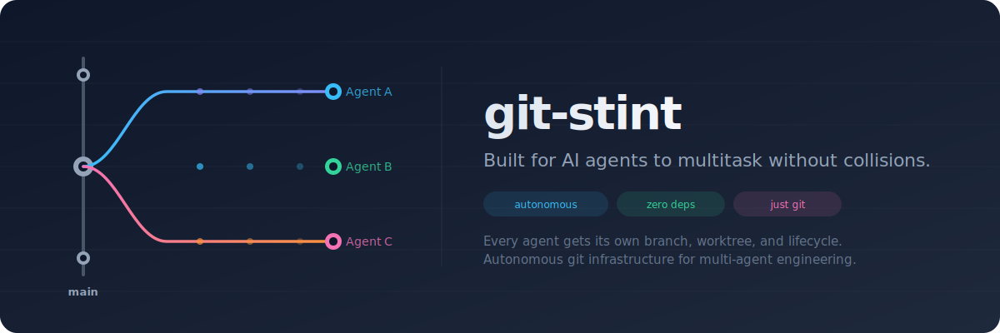

# git-stint

<p align="center">
  
</p>

[](https://www.npmjs.com/package/git-stint)
[](https://github.com/rchaz/git-stint/actions)
[](LICENSE)
[](https://nodejs.org)

**Built for AI agents to multitask without collisions.**

Run multiple AI coding agents in parallel — each one gets its own branch, its own worktree, and its own lifecycle. git-stint handles the branching, tracking, checkpointing, and cleanup autonomously. You focus on the work. The grunt work is managed under the hood.

No cloud VMs. No Docker containers. No desktop app. No new VCS to learn. Just git — with session management that runs itself.

```
Agent A fixes auth     ──→  .stint/auth-fix/     → builds, tests, PRs independently
Agent B adds search    ──→  .stint/add-search/   → builds, tests, PRs independently
Agent C writes docs    ──→  .stint/update-docs/  → builds, tests, PRs independently
You keep working       ──→  main branch, untouched
```

## The Problem

When an AI coding agent works on your repo, you lose track of what it changed, your main branch accumulates half-finished work, and running two agents at once creates conflicts. There's no clean way to:

- **Separate agent changes from human changes** — who wrote what?
- **Run agents in parallel** — two agents on the same branch will collide
- **Get clean, reviewable PRs** — agent work is often a stream of small edits
- **Undo an agent's work** — reverting scattered changes across files is painful
- **Prevent accidental damage** — agents write to `main` unless something stops them

## How git-stint Solves This

Each agent session gets a **real git branch** and a **worktree** — not virtual branches, not overlays, not a custom VCS. Standard git, fully compatible with every tool you already use.

Every step of the session lifecycle is autonomous:

| What happens | What git-stint does | You do anything? |
|---|---|---|
| Agent writes its first file | Auto-creates a session branch + worktree | No |
| Agent keeps writing files | Hooks track every change automatically | No |
| Agent builds or runs tests | Runs in the isolated worktree — can't break main | No |
| Conversation ends unexpectedly | Auto-commits a WIP checkpoint — nothing lost | No |
| Work is ready to ship | `git stint squash` + `git stint pr` = clean PR | One command |
| Session is done | `git stint end` cleans up branch, worktree, and remote | One command |

## Key Features

**Fully autonomous** — Install once, then forget about it. Hooks intercept file writes, create sessions, track changes, and checkpoint work without any manual intervention. The agent works on its stint. git-stint manages everything else.

**Parallel agents, zero conflicts** — Each agent instance gets its own session via process ID. Three Claude Code windows? Three isolated branches. Each can build, test, commit, and create PRs independently — no coordination required between them.

**Safe builds and tests** — Every session runs in its own worktree. `npm test`, `cargo build`, `go test` — all execute against that session's files only. One agent's broken build can't block another. `git stint test --combine A B` lets you verify multiple sessions work together before merging any of them.

**No work lost — ever** — Conversation timeout? Crash? User closes the window? The stop hook auto-commits pending changes as a WIP checkpoint. Come back later, the work is still there.

**Clean PRs from messy work** — An agent's stream of incremental edits becomes a single, reviewable commit with `git stint squash`. Create a PR with auto-generated descriptions in one command.

**Conflict detection before merge** — `git stint conflicts` checks file overlap across all active sessions. Know which agents are touching the same files *before* you try to merge.

**Shared directories** — Large caches (`node_modules`, `venv`, build outputs) are symlinked into worktrees instead of duplicated. Agents get fast startup, you save disk space.

**Zero dependencies** — Pure Node.js built-ins. No native modules, no runtime deps, no surprises. Installs in seconds.

**Just git underneath** — Real branches, real worktrees, real commits. `git log`, `git diff`, lazygit, VS Code, GitHub — every tool you already use works because there's nothing custom underneath.

## Quick Start

```bash
# Install
npm install -g git-stint

# Set up hooks in your repo
cd /path/to/your/repo
git stint install-hooks

# Start a session
git stint start auth-fix
cd .stint/auth-fix/

# Make changes, then commit
git stint commit -m "Fix token refresh logic"

# Squash into a clean commit and create a PR
git stint squash -m "Fix auth token refresh"
git stint pr --title "Fix auth bug"

# Clean up
git stint end
```

### With Claude Code

Tell Claude Code:

> Install git-stint globally (`npm install -g git-stint`), set up hooks for this repo, and create a .stint.json

Or manually:

```bash
npm install -g git-stint
cd /path/to/your/repo
git stint install-hooks    # Writes to .claude/settings.json
```

Once hooks are installed, Claude Code automatically works in sessions. When `main_branch_policy` is `"block"`, the first file write auto-creates a session and redirects the agent — zero manual steps.

## Commands

| Command | Description |
|---------|-------------|
| `git stint start [name]` | Create a new session (branch + worktree) |
| `git stint list` | List all active sessions |
| `git stint status` | Show current session state |
| `git stint diff` | Show uncommitted changes in worktree |
| `git stint commit -m "msg"` | Commit changes, advance baseline |
| `git stint log` | Show session commit history |
| `git stint squash -m "msg"` | Collapse all commits into one |
| `git stint merge` | Merge session into current branch |
| `git stint pr [--title "..."]` | Push branch and create GitHub PR |
| `git stint end` | Finalize session, clean up everything |
| `git stint abort` | Discard session — delete all changes |
| `git stint undo` | Revert last commit, changes become pending |
| `git stint which [--worktree]` | Print resolved session name (or worktree path) |
| `git stint conflicts` | Check file overlap with other sessions |
| `git stint test [-- cmd]` | Run tests in the session worktree |
| `git stint test --combine A B` | Test multiple sessions merged together |
| `git stint track <file...>` | Add files to the pending list |
| `git stint prune` | Clean up orphaned worktrees/branches |
| `git stint allow-main` | Allow writes to main (scoped to one process) |
| `git stint install-hooks` | Install Claude Code hooks |
| `git stint uninstall-hooks` | Remove Claude Code hooks |

### Options

| Flag | Description |
|------|-------------|
| `--session <name>` | Target a specific session (auto-detected from CWD) |
| `--client-id <id>` | Client identifier for multi-instance affinity |
| `--adopt` / `--no-adopt` | Control whether uncommitted changes carry into a new session |
| `-m "message"` | Commit or squash message |
| `--title "title"` | PR title |
| `--version` | Show version number |

## Configuration — `.stint.json`

Create a `.stint.json` in your repo root:

```json
{
  "shared_dirs": ["node_modules", ".venv", "dist"],
  "shared_files": [".env", ".python-version"],
  "post_create": ["uv sync"],
  "main_branch_policy": "block",
  "force_cleanup": "prompt",
  "adopt_changes": "always"
}
```

| Field | Values | Default | Description |
|-------|--------|---------|-------------|
| `shared_dirs` | `string[]` | `[]` | Directories to symlink from worktree to main repo. Use for gitignored dirs (caches, build outputs) that shouldn't be duplicated per session. |
| `shared_files` | `string[]` | `[]` | Files to symlink from main repo into each new worktree. Like `shared_dirs` but for individual files — use for untracked config files (`.env.keys`, `service-account.json`) that should stay in sync with main. |
| `post_create` | `string[]` or `string` | `[]` | Shell command(s) to run in the new worktree after creation. Use for project setup (e.g., `uv sync`, `pip install -r requirements.txt`). Commands run sequentially; failures warn but don't abort session creation. |
| `main_branch_policy` | `"block"` / `"prompt"` / `"allow"` | `"prompt"` | What happens when an agent writes to main. `"block"` auto-creates a session. `"prompt"` blocks with instructions. `"allow"` passes through. |
| `force_cleanup` | `"force"` / `"prompt"` / `"fail"` | `"prompt"` | Behavior when worktree removal fails. |
| `adopt_changes` | `"always"` / `"never"` / `"prompt"` | `"always"` | Whether uncommitted changes on main carry into new sessions. |

### Main Branch Policy

The hook intercepts every file write from the AI agent:

- **`"block"`** — Auto-creates a session on the first write. The agent is seamlessly redirected to the worktree. Most protective mode.
- **`"prompt"`** (default) — Blocks with a message showing the exact command to unblock (`git stint allow-main --client-id <PID>`). Lets you decide per-situation.
- **`"allow"`** — Passes through. Hooks still track files in existing sessions but don't enforce session usage.

The `allow-main` flag is scoped per-process. When the hook blocks a write, it prints the exact command with the correct `--client-id`. Only that specific agent instance is unblocked — other instances stay protected. Stale flags from dead processes are cleaned by `git stint prune`.

### Adopting Uncommitted Changes

When you run `git stint start` with uncommitted changes on main:

- **`"always"`** (default) — Stashes changes, pops them into the new worktree. Your work carries over seamlessly.
- **`"never"`** — Leaves uncommitted changes on main. New worktree starts clean.
- **`"prompt"`** — Warns and suggests `--adopt` or `--no-adopt`.

```bash
git stint start my-feature --adopt       # Force adopt regardless of config
git stint start my-feature --no-adopt    # Skip regardless of config
```

### Shared Files

Like `shared_dirs` but for individual files. Symlinks each file from main into the worktree so changes stay in sync:

```json
{
  "shared_files": [".env.keys", "service-account.json", "config/local.yaml"]
}
```

Files that don't exist are skipped with a warning. Files already present in the worktree (e.g., tracked by git) are not overwritten. Symlinked files are automatically added to the worktree's `.gitignore`.

### Post-Create Hooks

Run setup commands automatically after worktree creation. Commands execute in the new worktree directory:

```json
{
  "post_create": ["uv sync", "cp .env.example .env"]
}
```

A single string is also accepted: `"post_create": "npm install"`. Commands run sequentially. A failing command prints a warning but does not prevent session creation — subsequent commands still run.

## How It Works

### Session Model

Each session creates three things:

```
Branch:    stint/auth-fix          (real git branch, forked from HEAD)
Worktree:  .stint/auth-fix/       (isolated working directory)
Manifest:  .git/sessions/auth-fix.json  (session state, disposable)
```

The **baseline cursor** advances on each commit. `git diff baseline..HEAD` always shows exactly the uncommitted work — no guesswork about what changed.

### Session Resolution

You rarely need `--session`. git-stint resolves the active session automatically:

1. Explicit `--session <name>` flag
2. CWD inside a `.stint/<name>/` worktree
3. Process-based affinity (agent's PID maps to its session)
4. Single session fallback (if only one session exists)

### Parallel Sessions

Each session is fully isolated — separate branch, separate worktree, separate filesystem. Agents can safely do everything in parallel:

```
Session A: .stint/auth-fix/     ──→  edit, build, test, commit, PR
Session B: .stint/add-tests/    ──→  edit, build, test, commit, PR
Session C: .stint/refactor/     ──→  edit, build, test, commit, PR
                                          └── all running simultaneously
```

One agent's `npm install` doesn't interfere with another's build. One agent's failing test doesn't block another's PR. Overlapping file edits are caught early by `git stint conflicts`, and final integration uses git's standard merge machinery.

### Claude Code Hooks

Two hooks make git-stint work automatically with Claude Code:

**PreToolUse** — Intercepts every `Write`, `Edit`, and `NotebookEdit` tool call. If the file is inside a session worktree, it's tracked. If it's on main, the hook enforces the configured policy (block, prompt, or allow). Writes to gitignored files always pass through.

**Stop** — When a conversation ends, commits all pending changes as a WIP checkpoint. No work is ever lost to timeouts or closed windows.

To install hooks globally (all repos):

```bash
git stint install-hooks --user
```

### Smart Cleanup

`git stint end` handles everything:

- Removes symlinks before deleting worktrees (linked data is never lost)
- Deletes the remote branch **only** when changes are verified merged on the remote — checks against `origin/main`, not local branches
- Two-tier merge verification: commit ancestry for regular merges, content diff for squash/rebase merges
- Network errors never block cleanup — unmerged branches are preserved with a warning

### Safety

- All git commands use `execFileSync` with array arguments — no shell injection
- Session names are validated (alphanumeric, hyphens, dots, underscores — no path traversal)
- Manifest writes are atomic (temp file + rename) — crash-safe
- `.stint/` is excluded via `.git/info/exclude` — never pollutes `.gitignore`

## Prerequisites

- [Node.js](https://nodejs.org) 20+
- [git](https://git-scm.com) 2.20+ (worktree support)
- [`gh` CLI](https://cli.github.com) (optional, for `git stint pr`)

## Development

```bash
git clone https://github.com/rchaz/git-stint.git
cd git-stint
npm install
npm run build
npm link          # Install globally for testing

# Run tests
npm test              # Unit tests
npm run test:all      # Everything (build + all tests)
```

## Contributing

See [CONTRIBUTING.md](CONTRIBUTING.md) for development setup, testing, and PR guidelines.

This project uses a [Code of Conduct](CODE_OF_CONDUCT.md).

## License

MIT — see [LICENSE](LICENSE)
